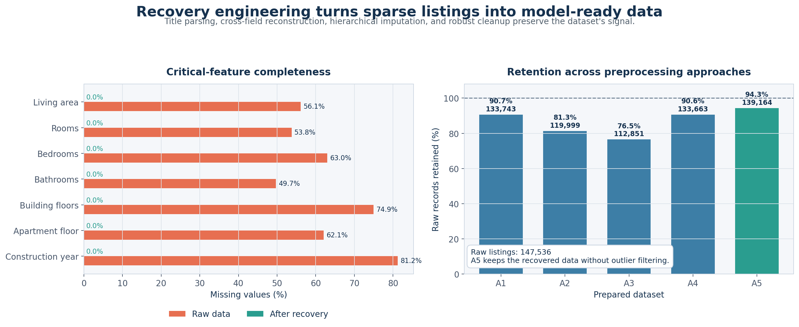
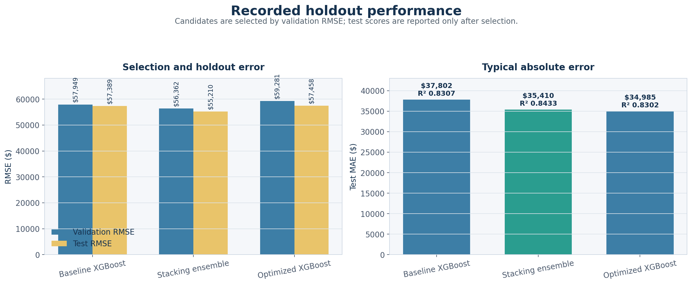
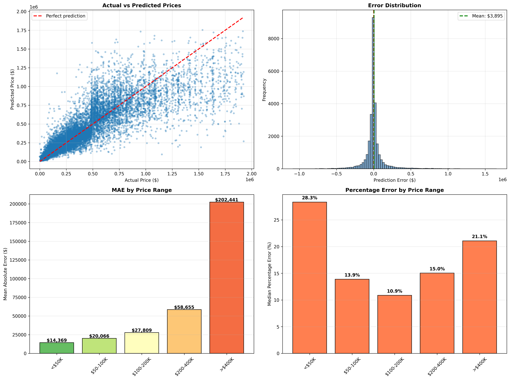

<h1 align="center">World Real Estate Price Prediction</h1>

<p align="center">
  
  
  
</p>

<p align="center">
  An end-to-end workflow for recovering incomplete global property data and predicting real estate listing prices in US dollars.
</p>

> This repository was completed as a **machine learning class project**. It is intended for learning, experimentation, and academic demonstration—not production valuation or financial decision-making.

## Dataset

The project uses Toriqul Islam's **World's Real Estate Data (147K)** dataset, available on Kaggle:

**[View and download the dataset on Kaggle](https://www.kaggle.com/datasets/toriqulstu/worlds-real-estate-data147k)**

## The main challenge: recovering the data

The hardest and most important part of this project was not choosing a model. It was turning a heavily incomplete collection of international property listings into defensible, model-ready data without discarding most of it.

The raw dataset contains **147,536 listings** and **658,948 missing cells**. Only **1,790 listings** are complete across eight important numeric property fields. A simple `dropna()` strategy would therefore throw away nearly all of the useful information.

Instead, the project builds a domain-aware recovery pipeline:

1. **Parse semi-structured titles** to recover room counts, property types, and area hints.
2. **Normalize area fields and units** so values can be compared consistently.
3. **Reconstruct area bidirectionally**: infer total area from living area, or living area from total area, using a robust median ratio learned from complete listings.
4. **Recover rooms hierarchically** using country, property type, and price-tier medians, with broader fallback groups when detailed groups are sparse.
5. **Derive bedrooms and bathrooms** from observed room relationships instead of applying a single global fill value.
6. **Recover building attributes** with country/price-tier medians followed by country-level fallbacks.
7. **Consolidate rare categories and handle outliers** before exporting multiple preprocessing variants for different model families.

This work brings the shared modeling features to **0% missingness**. The least-filtered prepared dataset retains **139,164 listings—94.3% of the raw records**.



## Modeling workflow

After recovery, the project compares five preprocessing strategies and several regression families:

- Random Forest and HistGradientBoosting
- XGBoost, LightGBM, and CatBoost
- log-target models
- stacking and weighted ensembles

Model selection now follows one consistent rule: **choose the candidate with the lowest validation RMSE**. Test data is used only once the candidate has been selected. Weighted ensembles are constrained to non-negative weights that sum to one, preventing unstable negative-weight blends.

```text
Raw listings
    ↓
Title parsing + cross-field reconstruction
    ↓
Hierarchical, data-driven recovery
    ↓
Five preprocessing variants
    ↓
Train / validation / test split
    ↓
Select by validation RMSE
    ↓
Report untouched test performance
```

## Recorded results

The existing notebook run produced these representative metrics:

| Configuration | Validation RMSE | Test MAE | Test RMSE | Test R² |
|---|---:|---:|---:|---:|
| Baseline XGBoost | $57,949 | $37,802 | $57,389 | 0.8307 |
| **Stacking ensemble** | **$56,362** | $35,410 | **$55,210** | **0.8433** |
| Optimized XGBoost | $59,281 | **$34,985** | $57,458 | 0.8302 |

The stacking ensemble is the recorded champion under the project’s primary criterion because it has the lowest validation RMSE. It also has the best recorded test RMSE and R². Optimized XGBoost has a slightly lower test MAE, illustrating why declaring the selection metric in advance matters.



The detailed error analysis shows that absolute error rises sharply for high-value properties and that the global model tends to compress predictions toward the middle of the market.



> The displayed values come from the recorded notebook run. The selection and ensemble code has since been corrected, so the training notebook should be rerun before publishing refreshed metrics or a new champion artifact.

## Repository structure

```text
.
├── 01_data_exploration_and_preparation.ipynb
├── 02_model_training_and_evaluation.ipynb
├── 03_compare_preprocessing_approaches.ipynb
├── archive/                         # Earlier training experiments
├── models/legacy/                   # Historical pre-cleanup artifact
├── plots/                           # Recovery and evaluation figures
├── preprocessed_data/               # Five modeling-ready datasets
├── report.pdf                       # Compiled academic project report
├── world_real_estate_data(147k).csv # Raw dataset
├── requirements.txt
└── README.md
```

### Main notebooks

- **01 — Data exploration and preparation:** investigates missingness, implements the recovery pipeline, performs exploratory analysis, and exports five prepared datasets.
- **02 — Model training and evaluation:** trains baseline, boosted, tuned, and ensemble candidates; ranks them by validation RMSE; and reports holdout performance.
- **03 — Preprocessing comparison:** compares the same model families across all five prepared datasets using a 70/10/20 train/validation/test split.

Earlier iterations remain in `archive/` for reference, but they are not part of the recommended workflow.

## Data preparation strategies

| Approach | Strategy | Intended use | Records retained |
|---|---|---|---:|
| A1 | Percentile filtering + log transforms | Stable, normalized inputs | 133,743 |
| A2 | IQR filtering + log transforms | Robust outlier handling | 119,999 |
| A3 | Minimal filtering + raw scale | Tree-based models | 112,851 |
| A4 | Z-score filtering + raw scale | Conventional statistical filtering | 133,663 |
| A5 | No outlier filtering | Recovery baseline | 139,164 |

All variants retain the same target, `price_in_USD`, and a compact set of location, property, area, room, floor, and construction-year features.

## Libraries

| Purpose | Libraries |
|---|---|
| Data handling | pandas, NumPy |
| Modeling | scikit-learn, XGBoost, LightGBM, CatBoost |
| Optimization | SciPy, Optuna |
| Visualization | Matplotlib, Seaborn, Plotly |
| Workflow and artifacts | JupyterLab, tqdm, joblib |

The complete install list is maintained in [`requirements.txt`](requirements.txt).

## Getting started

### 1. Create and activate an environment

```bash
python -m venv .venv
```

Windows PowerShell:

```powershell
.\.venv\Scripts\Activate.ps1
```

macOS/Linux:

```bash
source .venv/bin/activate
```

### 2. Install dependencies

```bash
python -m pip install --upgrade pip
pip install -r requirements.txt
```

### 3. Run the project

Start Jupyter from the repository root so relative data paths resolve correctly:

```bash
jupyter lab
```

Run the numbered notebooks in order. Notebook 02 performs the expensive model training; notebook 03 provides a smaller comparison workflow.

## Reproducibility and limitations

- A fixed random seed is used for dataset splits and supported estimators.
- Candidate selection uses validation RMSE; test metrics do not influence ranking.
- Results may vary with library versions and available CPU/GPU hardware.
- The dataset combines countries with very different market behavior.
- Neighborhood amenities, condition, market timing, and comparable sales are unavailable.
- Recovered fields depend on explicit assumptions documented in notebook 01.
- Serialized `joblib` models should only be loaded from trusted sources with compatible package versions.
- The artifact under `models/legacy/` predates the corrected selection logic and is retained only for historical reproducibility.

## Academic report

The compiled academic report is available as [`report.pdf`](report.pdf). It documents the data-quality problem, recovery strategy, exploratory findings, preprocessing approaches, and modeling framework.
